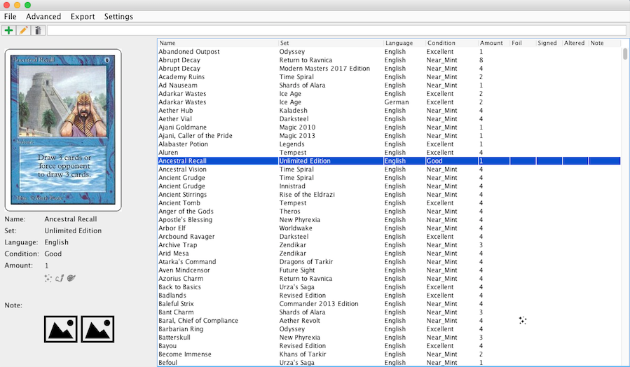

# Card Collection Manager

## Project Description
This projects provides a management application for Magic the Gathering card collections. Its aim is to be a simple solution to keep track of collections. The main reason why I wrote this application is because I required a tool, which can manage single card images of a large collection, besides common card collection management features.

The application is completely written in Java, using Swing for the graphic interface and the built-in serialization for saving the collection data.

## License
This project is licensed under the zlib license. See also the attached [LICENSE](./LICENSE) file.

## How to use
You find the latest stable build as a release of this repo.

Be aware that you can edit the directory in which the application stores both, your card data as well as your uploaded images.
It is highly recommended to adjust this to your requirements before you start using the application since later editing might
lead to inconsistent data.

## How to update
If you want to update your local version of the application. Just overwrite your local `CardCollectionManager.jar` with the one
you find in the archive file of the latest release. Do however not overwrite your data or config files.

## How to build/ contribute
### Contribute
The project includes configuration of [VSCode development containers](https://code.visualstudio.com/docs/remote/containers) which should be the preffered environment to develop new features of the app. The container automatically installs the [Extension Pack for Java](https://marketplace.visualstudio.com/items?itemName=vscjava.vscode-java-pack) which should be all you need to develop in Java.

Additionally, if you want to run the GUI out of the container, you need to use a X11 tool. I will briefly explain how to run them in order to display the GUI from the container.

**Windows**<br>
I recommend [VcXSrv](https://sourceforge.net/projects/vcxsrv/) if your host system is Windows. Once you have it installed, start VcXSsrv via `xlaunch.exe` and enable the option `Disable access control` before you start the server. Now, you can start a GUI app in your container that will be displayed via the X-server on the host system.

**MacOS**<br>
Install [XQuartz](https://www.xquartz.org/) and run it via the following command:
```
xhost +localhost
```
Now, you can start a GUI app in your container that will be displayed via the X-server on the host system.

### Local Building
* Execute `mvn clean` in order to cleanup the build directory.
* Execute `mvn package` in order to compile the project and create various archive files in folder `build/`, ready for shipping.

### Remote Building
Actual versions are automatically built via GitHub Action pipelines defined at [`.github/workflows`](./.github/workflows/).

## Toolkit
* [Apache Maven v.3.5.0](https://maven.apache.org/) - The famous build management tool, specialized for Java projects.
	
		* Maven Assembly Plugin v.3.1.0

* [Apache Log4j v.2.8.2](https://logging.apache.org/log4j/2.x/) - The famous logging framework for Java applications.

* [Apache POI v.3.17](https://poi.apache.org) - Java based library to work with Microsoft Office files.

* [JDatePicker v.1.3.4](https://jdatepicker.org) - JDatePicker and JDatePanel is an set of advanced DatePicker controls for Java Swing applications.

* [JIDE Common Layer v.3.6.18](https://github.com/jidesoft/jide-oss) - Library of enriched Swing components. This is only the basis for the JIDE software products, which JIDE decided to put under open source.

* [Magic: The Gathering Java SDK v.0.0.6](https://github.com/MagicTheGathering/mtg-sdk-java) - Java based encapsulation of the offical [MtG API](https://magicthegathering.io).
